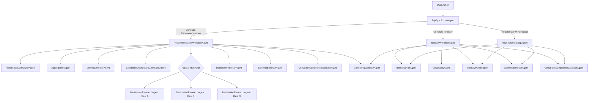
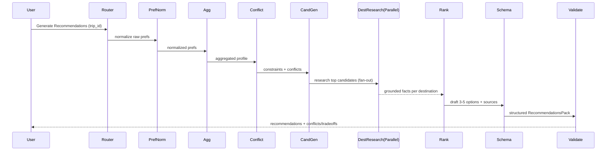
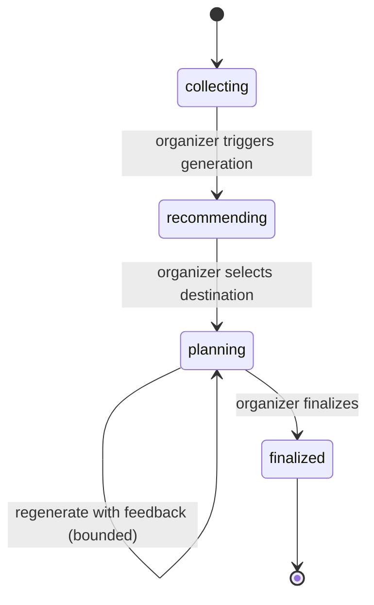

# TripSync Agent-Layer PRD (Google ADK Python)

## 1) Overview

TripSync’s goal is to eliminate “group chat chaos” in trip planning by **collecting structured preferences** from participants and using **AI to generate destination recommendations and full itineraries** that satisfy the group’s aggregated constraints. 

This PRD designs **only the agent system** (Google ADK Python + Gemini). The system must support the core flows: **generate 3–5 destination options** and later **generate a day-by-day itinerary**, with a feedback/regeneration loop. 

---

## 2) Scope

### In scope (agent layer only)

* Multi-agent architecture in **Google ADK (Python)** with clear responsibilities, coupling, and orchestration patterns. ([Google GitHub Pages][1])
* Agent workflows for:

  * Preference normalization + aggregation reasoning
  * Conflict detection (dates/budgets/constraints)
  * Destination recommendations (3–5 options)
  * Itinerary generation (morning/afternoon/evening, costs, tips)
  * Regeneration with feedback loop (bounded)
* Tool design (ADK Tools / FunctionTools) required by agents (no HTTP endpoint design). ([Google GitHub Pages][2])
* Validation agents:

  * Schema conformance (Pydantic models / structured outputs)
  * Constraint compliance (budget/dates/dietary/accessibility)
  * Grounding (web-backed destination claims)
  * Quality checks (completeness, internal consistency)
* Non-happy-path handling (invalid JSON, no overlap, timeouts, tool failures, partial responses, etc.). 
* Acceptance criteria for agent outputs.

### Out of scope

* Frontend layout, backedatabase schema details (except what agents need as “tools”).
* Real-time sync protocols (websocket), UI components, export (PDF/calendar) generation logic.
* Booking (flights/hotels) or payments.

---

## 3) Key constraints & ADK-specific design implications

1. **Shared state is first-class**: agents in a workflow communicate via `ctx.session.state` (and `output_key` can automatically store outputs). ([Google GitHub Pages][1])
2. **Parallel execution has no shared conversation history**, but can share `session.state`—use distinct keys to avoid collisions. ([Google GitHub Pages][3])
3. **`output_schema` limitation**: if you set `output_schema` on an agent, it cannot use tools. This forces a “tool-using generation” step followed by a “schema enforcement” step. ([Google GitHub Pages][4])
4. **Google Search tool limitations**: Google Search is only compatible with Gemini 2 models and supports *only one tool per agent*; design a dedicated Search agent. ([Google GitHub Pages][5])
5. **Long-running operations**: itinerary/recommendation generation can take 30+ seconds and tokens can expire; ADK supports `LongRunningFunctionTool` patterns + event-based progress updates.  ([Google GitHub Pages][2])

---

## 4) User flows the agent layer must support

### Flow A: Generate destination recommendations

Organizer clicks “Generate Recommendations” → AI returns **3–5 destination cards** with “why it fits,” cost estimate, sample highlights, and tradeoffs. 

### Flow B: Generate itinerary fzer selects destination → clicks “Generate Itinerary” → AI produces a **day-by-day itinerary** with time slots, costs, locations, tips, and total cost. 

### Flow C: Regenerate with feedback (bounded loop)

Members flag items + suggest additions → organizer clicks “Regenerate with Feedback” → AI incorporates chmust prevent infinite loops).  

### Flow D: Compatibility/conflict visibility

Trip dashboard shows aggregated overlap windows and conflicts (e.g., no date 

---

## 5) Agent architecture

### 5.1 Agents (responsibilities + coupling)

**A) Orchestration**

1. **TripSyncRouterAgent (LLM)**

   * Routes intent: `recommendations`, `itinerary`, `regenerate`, `conflicts_ omposition (parent with sub-agents). ([Google GitHub Pages][1])

2. **RecommendationWorkflowAgent (Workflow: Sequential + Parallel fan-out)**  (Workflow: Sequential + Parallel fan-out)**

3. **RegenerationLoopAgent (Workflow: LoopAgent)** with bounded iterations and stop conditions. ([Google GitHub Pages][1])

**B) Preference & constraint intelligence**
5) **PreferenceNormalizerAgent (LLM)**

* Normalizes free-text “whatever”/vague inputs into structured preferences (confidence + inferred ranges). Supports the “Whatever” persona by turning flexibility into usable data. 

6. **AggregationAgent (Custom, non-LLM)**

   * Deterministic aggregation for overlaps and ranges (dates, budget min/max, vibes intersection).
   * Produces `AggregatedGroupProfile`.

7. **ConflictDetectorAgent (LLM + Custom checks)**

   * Interprets “why” conflicts exist, ranks severity, suggests resolution paths (e.g., “need 1 person to widen date window”).
   * Must handle: empty overlaps, conflicting budgets, “all flexible,” single-member trips. 

**C) Destination recommendationGeneratorAgent (LLM)**

* Generates an initial slate (e.g., 8–12) based on aggregated profile.

9. **DestinationResearchAgent (LLM + GoogleSearch tool)**

   * Collects grounded facts (seasonality, typical cost signals, key highlights, travel time heuristics).
   * Must be isolated due to Google Search tool constraints. ([Google GitHub Pages][5])

10. **DestinationRankerAgent (LLM)**

* Scores candidates vs constraints, selects 3–5, identifieseneration**

11. **ItineraryDraftAgent (LLM)**

* Produces day-by-day draft aligned to vibes, constraints, budget.

12. **CostSanityAgent (LLM + Custom math tool)**

* Checks totals, detects obvious under/over budgeting, flags high-variance assumptions.

13. **ItineraryPolishAgent (LLM)**

* Improves clarity, removes contradictions, ensures each day has coherent flow.

**E) Validation & safety**
14) **SchemaEnforcerAgent (LLM with `output_schema`)**

* Converts draft into strict Pydantic output for storage.
* Must not use tools. ([Google GitHub Pages][4])

15. **ConstraintComplianceValidatorAgent (LLM)**

* Validates against *hard constraints*: dates, budget hard limits, dietary/accessibility flags, hard “no’s”. 

16. **GroundingValidatorAgent (LLM)**

* Ensures any factual destination claims used in user-visible reasoning are backed by research results (and surfaces “search suggestions” if present). ([Google GitHub Pages][6])

---

## 6) Session state contracts (shared data model)

Agents communicate via `ctx.session.state` (ADK recommended) and workflow ordering (`SequentialAgent`, `ParallelAgent`, `LoopAgent`). ([Google GitHub Pages][1])

### 6.1 State keys (canonical)

* `trip_context`: Trip metadata, status, member count.
* `raw_preferences[]`: Raw per-member preferences payloads.
* `normalized_preferences[]`: Post-normalization preferenceed_group_profile`: Deterministic aggregate + derived constraints.
* `conflict_report`: Conflicts + resolution suggestions.
* `candidate_destinations[]`: Initial destination list (8–12).
* `destination_research{dest->facts}`: Grounded research per candidate.
* `recommendations_draft`: Freeform draft.
* `recommendations_final`: Structured `RecommendationsPack` (schema enforced).
* `selected_destination`: Destination chosen for itinerary.
* `itinerary_draft`: Freeform itinerary.
* `itinerary_final`: Structured `Itinerary` (schema enforced).
* `feedback_items[]`: Member feedback signals for regen.
* `regen_count`: Integer; enforce max iterations.
* `progress_events[]`: Human-readable progress updates.

---

## 7) Output schemas (Pydantic-first)

> Note: use a **SchemaEnforcerAgent** to produce these final objects because ADK `output_schema` agents can’t use tools. ([Google GitHub Pages][4])

### 7.1 RecommendationsPack (final)

```python
from pydantic import BaseModel, Field
from typing import List, Optional, Literal, Dict

class MoneyRange(BaseModel):
    currency: str = "USD"
    per_person_low: int
    per_person_high: int
    includes: List[Literal["flights","accommodation","food","activities"]] = []

class Tradeoff(BaseModel):
    title: str
    description: str
    severity: Literal["low","medium","high"]

class DestinationOption(BaseModel):
    name: str
    region: str
    why_it_fits: List[str]
    estimated_cost: MoneyRange
    sample_highlights_2day: List[str]
    tradeoffs: List[Tradeoff]
    confidence: Literal["low","medium","high"]
    sources: List[str] = Field(default_factory=list)  # grounding links/refs (from research agent)

class RecommendationsPack(BaseModel):
    trip_id: str
    generated_at_iso: str
    group_summary: Dict[str, str]  # short summary of constraints/vibes
    conflicts: List[str] = []
    options: List[DestinationOption] = Field(min_length=3, max_length=5)
```

### 7.2 Itinerary (final)

```python
class ItineraryActivity(BaseModel):
    title: str
    description: str
    neighborhood_or_area: Optional[str] = None
    estimated_cost_per_person: int
    duration_minutes: Optional[int] = None
    tips: List[str] = []

class ItineraryDay(BaseModel):
    day_index: int  # 1..N
    date_iso: Optional[str] = None
    morning: List[ItineraryActivity]
    afternoon: List[ItineraryActivity]
    evening: List[ItineraryActivity]

class Itinerary(BaseModel):
    trip_id: str
    destination_name: str
    total_estimated_cost_per_person: int
    assumptions: List[str] = []
    days: List[ItineraryDay]
    sources: List[str] = Field(default_factory=list)
```

### 7.3 ConflictReport (dashboard + guidance)

```python
class Conflict(BaseModel):
    kind: Literal["dates","budget","constraints","vibes"]
    summary: str
    severity: Literal["low","medium","high"]
    suggested_resolutions: List[str]

class ConflictReport(BaseModel):
    trip_id: str
    conflicts: List[Conflict]
    compatibility_snapshot: Dict[str, str]  # e.g., overlap window, budget range, common vibes
```

---

## 8) Tools (FunctionTools) needed (no endpoints)

ADK tools are structured functions callable by agents; FunctionTools can derive schemas from function signatures. ([Google GitHub Pages][2])

### 8.1 Data access tools (internal)

* `load_trip_context(trip_id: str) -> dict`
* `load_member_preferences(trip_id: str) -> list[dict]`
* `load_existing_recommendations(trip_id: str) -> Optional[dict]`
* `load_existing_itinerary(trip_id: str) -> Optional[dict]`
* `store_recommendations(trip_id: str, payload: dict) -> None`
* `store_itinerary(trip_id: str, payload: dict) -> None`
* `store_progress(trip_id: str, message: str, stage: str) -> None`

### 8.2 Deterministic computation tools

* `compute_date_overlap(preferences: list[dict]) -> dict`

  * returns overlap window + “none” if impossible.
* `compute_budget_range(preferences: list[dict]) -> dict`
* `intersect_vibes(preferences: list[dict]) -> dict`
* `extract_hard_constraints(preferences: list[dict]) -> dict`

### 8.3 Grounding tools

* **GoogleSearch tool** in a dedicated agent (per ADK constraints). ([Google GitHub Pages][5])

  * Used only to gather factual support; outputs stored into `destination_research`.

### 8.4 Long-running orchestration tool (optional but recommended)

* Wrap itinerary/recommendation generation as a **LongRunningFunctionTool** that returns an operation id and progress messages (prevents blocking; supports resume/progress). ([Google GitHub Pages][2])

---

## 9) Workflows (Mermaid)

### 9.1 High-level agent topology



### 9.2 Recommendation workflow (sequence)



### 9.3 Trip status state machine (agent-impacting)

Trip status progression is expected as `collecting → recommending → planning → finalized`. 



---

## 10) Prompt designs (agent instructions)

> All prompts below assume the agent reads inputs from `ctx.session.state` and writes outputs back via `output_key` (or explicit state writes). ADK supports this pipeline pattern. ([Google GitHub Pages][1])

### 10.1 TripSyncRouterAgent (LLM)

**System / instruction (template)**

* You are the TripSync router. Decide which workflow to run based on the user action and trip status.
* Allowed actions: `recommendations`, `itinerary`, `regenerate`, `conflicts_only`, `explain`.
* If required inputs are missing (e.g., no selected destination for itinerary), return a **blocking clarification** object with what’s missing and why.
* Never fabricate facts abouacts, request the research workflow.

### 10.2 PreferenceNormalizerAgent

* Convert vague text like “I’m down for anything” into structured fields with **wide ranges** and **low confidence**.
* Preserve explicit hard constraints verbatim (hard no’s, allergies, accessibility).
* Output: `normalized_preferences[]` with `confidence_by_field`.

### 10.3 ConflictDetectorAgent

* Input: `aggregated_group_profile` + raw constraints.
* Output: `ConflictReport` draft:

  * Identify conflict type (dates/budget/constraints/vibes), severity, and 1–3 resolutions (e.g., “ask 1 member to widen date window by 2 days”).
* If conflicts make planning impossible, recommend “collecting more preferences” or “relaxing constraints.”

### 10.4 CandidateDestinationGeneratorAgent

* Generate 8–12 candidates.
* Hard filter: exclude anything violating “hard no’s,” trip type (domestic/international if present), or must-have accessibility/dietary constraints.
* Include diversity (beach/city/nature mix) unless vibes are strict.

### 10.5 DestinationResearchAgent (GoogleSearch-only)

* For each destination: gather 5–10 bullet facts relevant to constraints: seasonality, typical cost signals, key neighborhoods/areas, 2-day highlight ideas.
* Save results as structured notes + `sources[]`.
* If search suggestions exist, store them for downstream display. ([Google GitHub Pages][6])

### 10.6 DestinationRankerAgent

* Choose 3–5 options.
* Each option must include: why it fits, cost estimate range, 2-day highlights, tradeoffs, confidence, and sources. 
* If date overlap is empty, options must explicitly say “dates unresolved” and propose next step.

### 10.7 ItineraryDraftAgent

* Produce day-by-day plan with morning/afternoon/evening activities, per-activity estimated costs, tips, and total. 
* Respect dietary/accessibility constraints and hard no’s. 
* Include assumptions when making estimates.

### 10.8 SchemaEnforcerAgent (output_schema)

* Convert drafts into `RecommendationsPack` or `Itinerary`.
* If something is missing, output a structured `needs_clarification` field instead of hallucinating (design this into the schema if desired).
  *(Reminder: this agent cannot call tools.)* ([Google GitHub Pages][4])

### 10.9 ConstraintComplianceValidatorAgent

* Validate final output:

  * Budget: options/activities must not exceed hard limit (if present)
  * Dates: itinerary length matches overlap window / trip length
  * Constraints: no forbidden items, no inaccessible requirements
* Output: `pass/fail` + minimal patch suggestions.

### 10.10 RegenerationLoopAgent (LoopAgent)

* Iterate: draft → validate → p == MAX`.
* Uses LoopAgent “stop when pass” pattern (escalate/stop condition). ([Google GitHub Pages][1])

---

## 11) Non-happy paths (must handle)

Grounded in known edge cases for this project: invalid JSON, impossible destinations, timeouts, no overl

### 11.1 Missing or insufficient n `needs_more_input` with targeted questions (dates/budget/vibes).

* If organizer proceeds with partial responses, label outputs with “confidence” and list what’s missing.

### 11.2 No date overlap

* Output a ConflictReport with severity=high and explicit resolution actions (who needs to widen their window).
* Recommendations can still be produced but must be flagged as “pending date resolution.”

### 11.3 Conflicting budgets / “impossible to satisfy all”

* Produce two “modes”:

  * **Consensus mode**: strictly satisfy all hard limits (may yield fewer/safer options).
  * **Compromise mode**: propose tradeoffs explicitly (who is impacted).

### 11.4 AI returns invalid JSON / schema mismatch

* SchemaEnforcerAgent + validator catches it; either:

  * auto-repair via regeneration loop (bounded), or
  * return a structured error with a retry recommendation.

### 11.5 Tool failures (search down, DB read error, timeout)

* Fail gracefully:

  * If grounding unavailable, produce “unverified” outputs and ask user to retry (or reduce to non-factual high-level suggestions).
  * Log progress/error event for UI display using ADK events approach. ([Google GitHub Pages][7])

### 11.6 Long-runation

* Use `LongRunningFunctionTool` pattern to start operation, emit progress, and allow resume. ([Google GitHub Pages][2])

---

## 12) Acceptance criteria (agent layer)

### Recommendations (Flow A)

* Returns **3–5** destination options, each containing:

  * why it fits, estimated cost per person, 2-day highlights, tradeoffs. 
* Includes an explicit conflict summary when relevant (e.g., no overlap). 
* Output strictly conforms to `RecommendationsPack` schema (no missing required fields).
* Grounding: each option includes `sources[]` when factual claims are used.

### Itinerary (Flow B)

* Produces day-by-day itinerary with morning/afternoon/evening, per-activity cost, tips, and total cost. 
* Respects constraints (dietary/accessibility/hard no’s) and budget mode.
* Output strictly conforms to `Itinerary` schema.

### Regeneration (Flow C)

* Incorporates feedback items and produces a new itinerary version.
* Enforces bounded iterations (e.g., max 5) to prevent infinite loops. 
* If cannot satisfy feedback due to constraints, returns a structured explanation + suggested alternatives.

### Robustness & observability

* Emits progress messages suitable for showing loading states (operations may take 30+ seconds). 
* Handles tool failures and invalid model outputs without crashing; returns actionable error objects.

---

## 13) Design recommendations (summary)

* **Separate “tool-using” vs “schema-enforcing” stages** (due to `output_schema` constraint). ([Google GitHub Pages][4])
* Use **ParallelAgent** for destination research fan-out; write each result([Google GitHub Pages][3])
* Use a **Generator–Critic pattern**: generation tion agents gate/repair; LoopAgent bounds retries. ([Google GitHub Pages][1])
* Dedicate a **GoogleSearch-only agent** (tool limitation + Gemini 2 constraint). ([Google GitHub Pages][5])
* Support long operations with **LongRunningFunctionTool + event-driven progress**. ([Google GitHub Pages][2])t, I can also provide a **single consolidated “Prompt Library” section** with copy/paste-ready ADK `instruction=` strings for each agent (Router/Recommendations/Itinerary/Validators), keeping them consistent with the schemas above and the TripSync flows.


[1]: https://google.github.io/adk-docs/agents/multi-agents/ "Multi-agent systems - Agent Development Kit"
[2]: https://google.github.io/adk-docs/tools-custom/function-tools/ "Overview - Agent Development Kit"
[3]: https://google.github.io/adk-docs/agents/workflow-agents/parallel-agents/?utm_source=chatgpt.com "Parallel agents - Agent Development Kit"
[4]: https://google.github.io/adk-docs/api-reference/python/google-adk.html "Submodules - Agent Development Kit documentation"
[5]: https://google.github.io/adk-docs/tools/limitations/ "Tool limitations - Agent Development Kit"
[6]: https://google.github.io/adk-docs/tools/gemini-api/google-search/ "Google Search - Agent Development Kit"
[7]: https://google.github.io/adk-docs/events/ "Events - Agent Development Kit"

